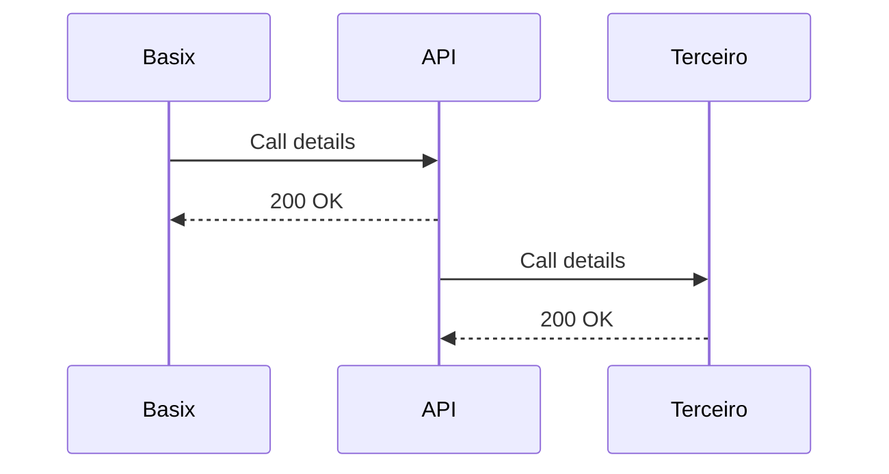
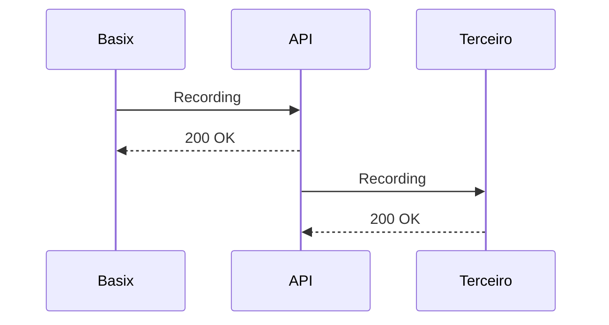

# API Basix - Cloud Comunicação

Esta API é responsável por fazer a integração do PBX Basix com sistemas de terceiros.
Atualmente estão disponíveis por esta API:

- **Pipedrive**
- **Basix Contact**
- **Zoho Desk**

O que a integração contempla:

**Screen Popup** Exibir em tela os dados da chamada corrente que esta chamando ou que foi atendida pelo operador.

**Transferência de Gravação** Faz o upload ou disponibiliza um link para fazer o download da gravação no CRM ao qual foi integrado.

# Pipedrive

Dados necessários:

https://**dominio**.pipedrive.com/settings/api

- Token

https://**dominio**.pipedrive.com/settings/caller

- Caller
- Tipo Pessoal
- Aplicativo de chamada padrão: Personalizar
- https://api.cloudcom.com.br/api/v1/integracao/pipedrive?from=[user_id]&to=[number]&deal_id=[deal_id]&person_id=[person_id]&basix_id=Eduardo@cloud.cloudcom.com.br

# Como fazer o deploy

1° - Clonar o repositório:
https://github.com/eduardofoliveira/cloudcom_api.git

2° - copiar o arquivo **.env.example** no arquivo **.env** e preencher as variáveis

3° - roda o comando **yarn build** ou **npm run build**

4° executar com o comando **node dist/server.js**

5° colocar em produção com pm2 **pm2 dist/server.js**

## Fluxo de funcionamento
Durante o **RING** ou no **ATENDIMENTO**

Ao termino do processamento da gravação:

